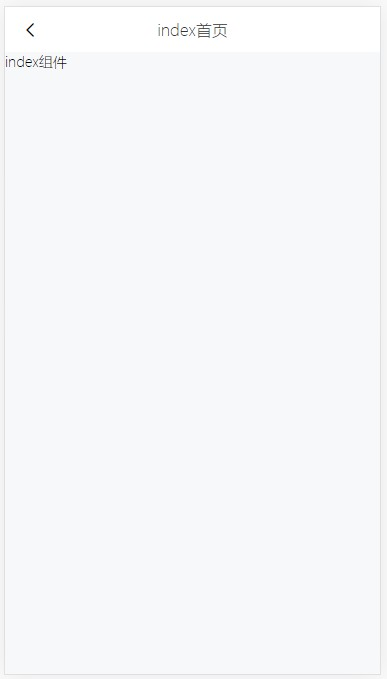

# Page 功能说明

> 页面顶部导航栏封装

## 图例



## 属性

| 参数            | 说明             | 类型    | 可选值 | 默认值   |
| --------------- | ---------------- | ------- | ------ | -------- |
| title           | 开启代码对比模式 | String  | -      | 默认标题 |
| leftText        | 左侧文字         | String  | -      | -        |
| rightText       | 右侧文字         | String  | -      | -        |
| showNav         | 是否显示顶部导航 | Boolean | -      | true     |
| isNeedRightIcon | 是否需要右侧图标 | Boolean | -      | false    |
| isNeedLeftIcon  | 是否需要左侧图标 | Boolean | -      | false    |

## 事件

| 事件名称     | 说明     | 回调函数 |
| ------------ | -------- | -------- |
| onClickLeft  | 点击左侧 | ()       |
| onClickRight | 点击右侧 | ()       |


## 示例

### 作为编辑器使用

```js
<template>
  <div id="app">
    <MonacoEditor
      height="300"
      :value="initValue"
      theme="vs"
      language="json"
      :options="options"
      @blur="onBlur"
    ></MonacoEditor>
  </div>
</template>

<script>
import MonacoEditor from "@/views/components/MonacoEditor";
export default {
  name: "App",
  components: {
    MonacoEditor
  },
  computed: {
    initValue() {
      return JSON.stringify(this.value, null, 4);
    }
  },
  data() {
    return {
      options: {},
      value: {
        title: "新的值",
        type: {
          type: "12",
          application: "使用",
          dayData: "123456",
          yearData: "654321",
          description: "描述a"
        },
        application: "使用",
        dayData: "123456",
        yearData: "654321",
        description: "描述a"
      },
      origin: {
        title: "原始值",
        type: {
          type: "12",
          application: "使用",
          dayData: "123456",
          yearData: "654321",
          description: "描述a"
        },
        application: "使用",
        dayData: "123456",
        yearData: "654321",
        description: "描述a"
      }
    };
  },
  methods: {
    onBlur(value) {
      this.value = JSON.parse(value);
      console.log("onBlur", this.value);
    }
  }
};
</script>
```

### 对比代码

> 只用于显示

```js
<template>
  <div id="app">
    <a-row>
      <a-col :span="12">初始代码</a-col>
      <a-col :span="12">新代码</a-col>
    </a-row>
    <MonacoEditor
      height="300"
      :diffEditor="true"
      :original="myOrigin"
      :value="myValue"
      language="json"
      :options="options"
    ></MonacoEditor>
  </div>
</template>

<script>
import MonacoEditor from "@/views/components/MonacoEditor";
export default {
  name: "App",
  components: {
    MonacoEditor
  },
  computed: {
    myValue() {
      return JSON.stringify(this.value, null, 4);
    },
    myOrigin() {
      return JSON.stringify(this.origin, null, 4);
    }
  },
  data() {
    return {
      options: {
        readOnly: true
      },
      value: {
        title: "新的值",
        type: {
          type: "12",
          application: "使用",
          dayData: "123456",
          yearData: "654321",
          description: "描述a"
        },
        application: "使用",
        dayData: "123456",
        yearData: "654321",
        description: "描述a"
      },
      origin: {
        title: "原始值",
        type: {
          type: "12",
          application: "使用",
          dayData: "123456",
          yearData: "654321",
          description: "描述a"
        },
        application: "使用",
        dayData: "123456",
        yearData: "654321",
        description: "描述a"
      }
    };
  }
};
</script>

```
