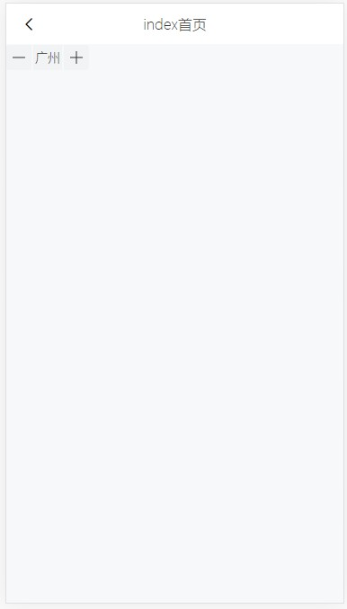

# RangeSelector 功能说明

> 范围选择器

## 图例



## 属性

| 参数  | 说明             | 类型   | 可选值 | 默认值 |
| ----- | ---------------- | ------ | ------ | ------ |
| range | 选择器的范围内容 | Array  | -      | []     |
| value | 默认选中的值     | String | -      | -      |

## 事件

| 事件名称 | 说明                 | 回调函数 |
| -------- | -------------------- | -------- |
| onChange | 选择范围时的回调函数 | (value)  |

## 示例

### 普通使用

```js
<template>
  <div>
      <RangeSelector :range="['北京', '上海', '广州']" value="广州" @onChange="changeSelector" />
  </div>
</template>
<script>
import RangeSelector from "@/components/RangeSelector/RangeSelector";
export default {
  name: "index",
  components: {
    RangeSelector,
  },
  methods: {
    changeSelector(value) {
      console.log("value", value);
    },
  },
};
```

