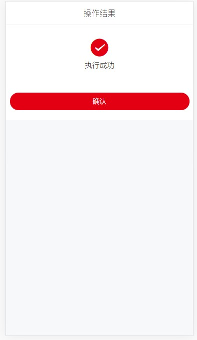

# StatusTip 功能说明

> 状态说明

## 图例



## 属性

| 参数         | 说明               | 类型   | 可选值       | 默认值   |
| ------------ | ------------------ | ------ | ------------ | -------- |
| status       | 当前状态           | String | success/fail | success  |
| successTip   | 成功提示文字       | String | -            | 执行成功 |
| successColor | 成功提示的图标颜色 | String | -            | \#E30012 |
| failTip      | 失败提示文字       | String | -            | 执行失败 |
| failColor    | 失败提示的图标颜色 | String | -            | \#666    |
| optTip       | 下方的操作按钮文字 | String | -            | 确认     |
| pageTitle    | 页面标题           | String | -            | 操作结果 |

## 事件

| 事件名称   | 说明                 | 回调参数 |
| ---------- | -------------------- | -------- |
| onClickOpt | 点击操作按钮回调事件 | ()       |

## 示例

### 普通使用

```js
<StatusTip status="success" />
```


